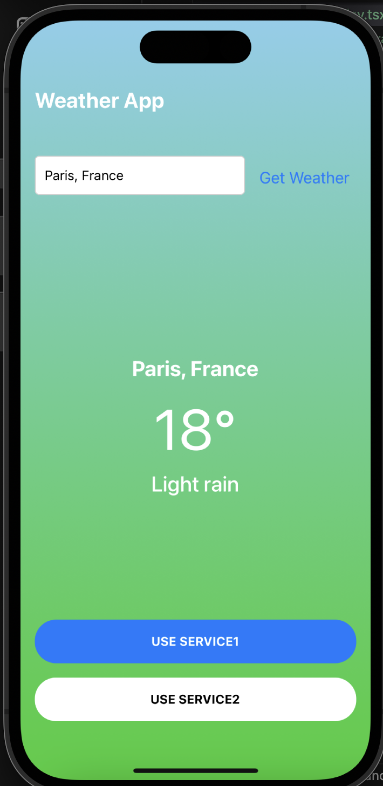
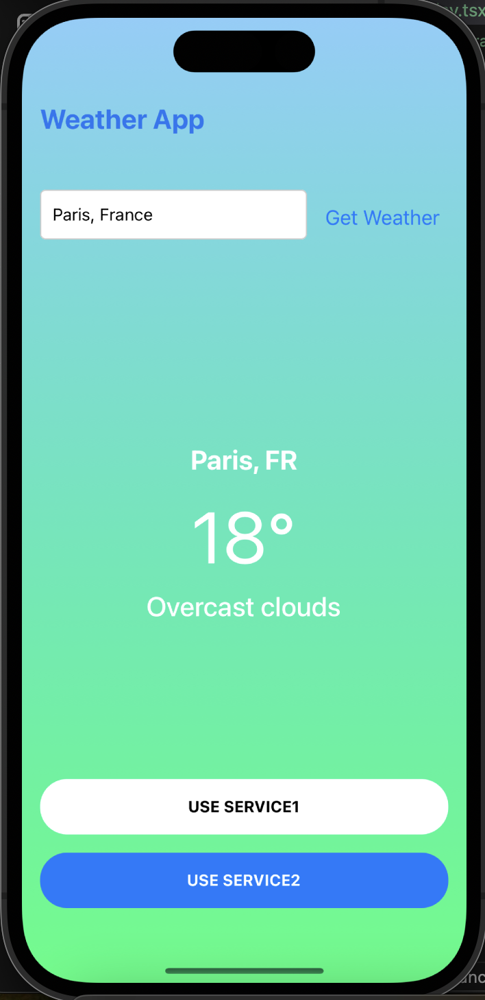
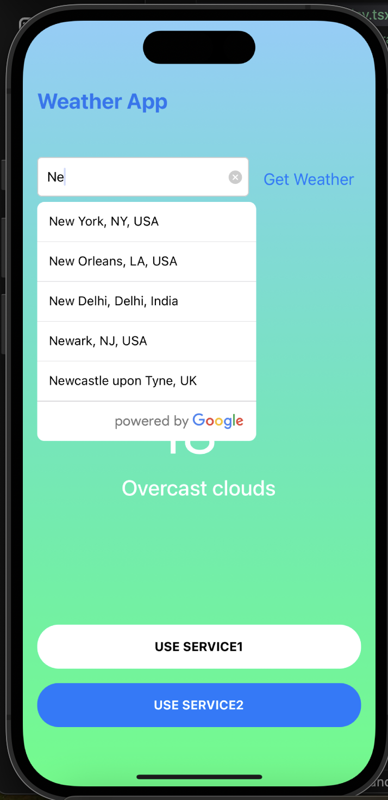

# Getting Started

>**Note**: Make sure you have completed the [React Native - Environment Setup](https://reactnative.dev/docs/environment-setup) instructions till "Creating a new application" step, before proceeding.

## Prerequisites

- create a .env file and add the enviroment variable
- **Node.js**: Make sure you are using Node.js version specified in the `.nvmrc` file or in the `engines` field of `package.json`.

### Setting up Node.js version

We recommend using `nvm` (Node Version Manager) to manage Node.js versions.

1. Install `nvm` by following the instructions [here](https://github.com/nvm-sh/nvm#installing-and-updating).
2. Navigate to the project directory.
3. Run the following command to switch to the required Node.js version:

   ```bash
   nvm install
   nvm use

## Step 1: Start the Metro Server

First, you will need to start **Metro**, the JavaScript _bundler_ that ships _with_ React Native.

To start Metro, run the following command from the _root_ of your React Native project:

```bash
# using npm
npm start

# OR using Yarn
yarn start
```

## Step 2: Start your Application

Let Metro Bundler run in its _own_ terminal. Open a _new_ terminal from the _root_ of your React Native project. Run the following command to start your _Android_ or _iOS_ app:

### For Android

```bash
# using npm
npm run android

# OR using Yarn
yarn android
```

### For iOS

```bash
# pod install
pod install

# using npm
npm run ios

# OR using Yarn
yarn ios
```

### For TESTS

```bash
# using npm
npm run test

# OR using Yarn
yarn test
```

<div style="display: flex; justify-content: space-between;">
  
  
  
</div>
